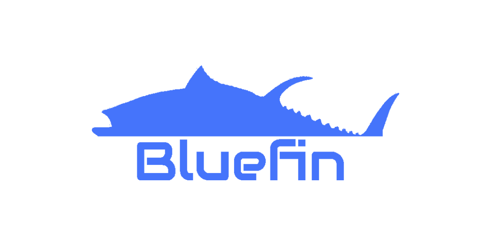

# bluefin

<div align="center">
    
</div>

A $TUNA miner, written in Go

__NOTE__: This miner is still a work in progress and may not be functional
          until a first release is made

# WE WANT YOU!!!

We're looking for people to join this project and help get it off the ground.

Discussion is on Discord at https://discord.gg/5fPRZnX4qW

# Development / Building

This requires Go 1.19 or better is installed. You also need `make`.

```bash
# Build
make
# Run
./bluefin
```

You can also run the code without building a binary, first
```bash
go run .
```
